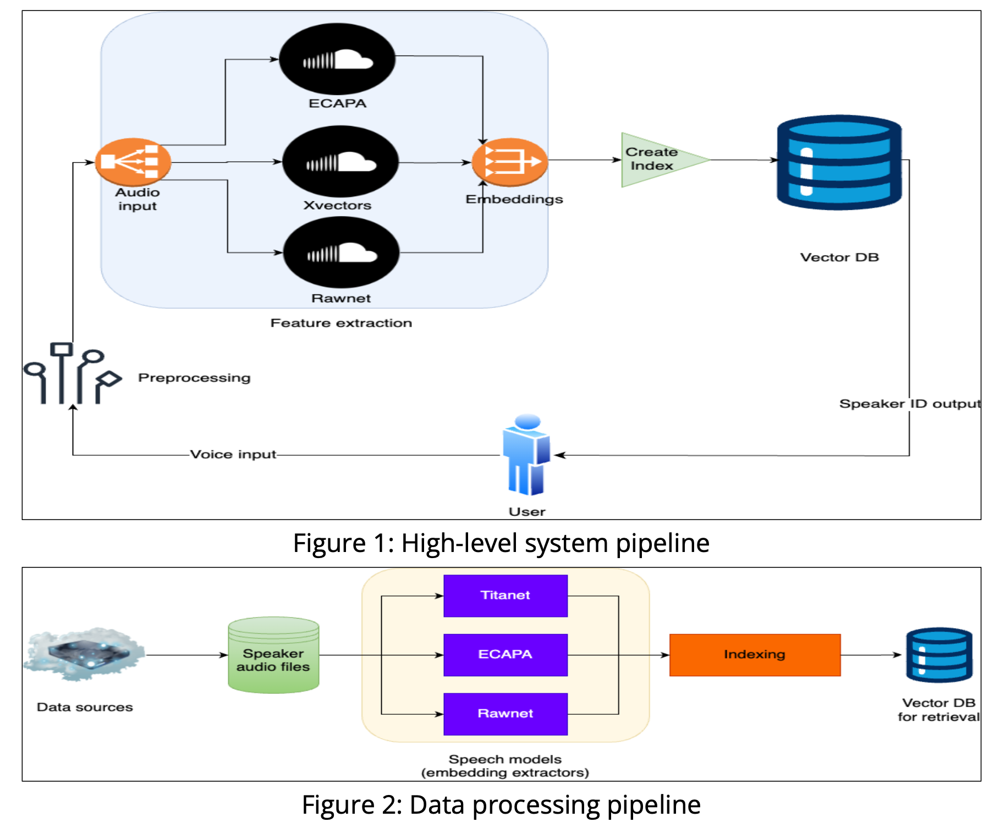

# Unified Framework for Speaker Verification

### Authors:
Moukhik Misra (moukhikm), Aryan Singhal (aryans), Bhiksha Raj

---

### Overview

Voice authentication is increasingly vital in sectors such as finance, healthcare, and personal technology, where secure and reliable identity verification is crucial. Systems must adapt to diverse environments, manage voice changes over time, and counter AI-generated spoofing threats that compromise security.

This project introduces a **scalable framework** using advanced models like **TitaNet**, **Rawnet**, and **ECAPA-TDNN** for accurate, real-time speaker verification and embedding retrieval. This framework is designed to enable robust and adaptable voice authentication.

---

### Hypothesis

Developing a unified, scalable, and adaptable speaker verification framework—leveraging a **state-of-the-art (SOTA) speaker embedding store** and enabling the rapid integration of new verification models—will facilitate accurate and secure speaker verification for **hundreds of millions of users**.

The framework incorporates:
- **Dynamic embedding management**.
- Support for advanced verification models.
- The ability to meet the demands of large-scale, high-stakes speaker authentication applications.

---

### System Design

---

### Dataset

**VoxCeleb-1**
- **Unique Speakers**: 1,251 (690 Male, 561 Female)
- **Utterances**: 153,516
- **Total Hours**: 352
- **Average Duration**: 8.2 seconds per utterance

---

### Results

---

### Evaluation and Error Analysis

The proposed framework demonstrates **high retrieval performance** with **extremely low latency**. This is primarily attributed to the **inverted file index** strategy used for indexing. 

Key Observations:
1. Baseline retrieval experiments using **linear search** resulted in extremely high latency.
2. The indexing approach provides similar performance to linear search while being **space-efficient** at the scale of 150K utterances.
3. The average overlap of **incorrectly retrieved speaker IDs** was:
   - **0.47%** using the indexing approach.
   - **0.62%** with baseline linear search.

**Error Trends**:
No noticeable patterns were observed in the incorrectly identified speaker IDs. These errors seem to stem from the varying properties of the models used.

---

### Conclusion

Our speaker verification framework addresses the increasing demand for **secure voice authentication** across various sectors. By leveraging advanced speaker embedding models, including **TitaNet** and **ECAPA-TDNN**, the framework:
- Delivers robust and adaptable verification capabilities.
- Operates at extremely low latency.
- Supports a large user base without compromising security.

**Future Directions**:
- Explore combining embeddings to enhance robustness.
- Optimize latency further using **data-driven hashing** and **sharding of the embedding space**.
